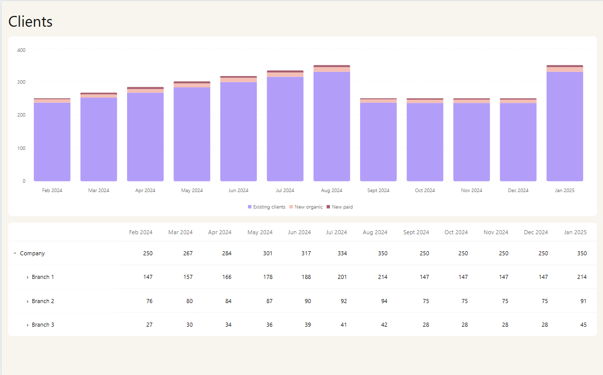
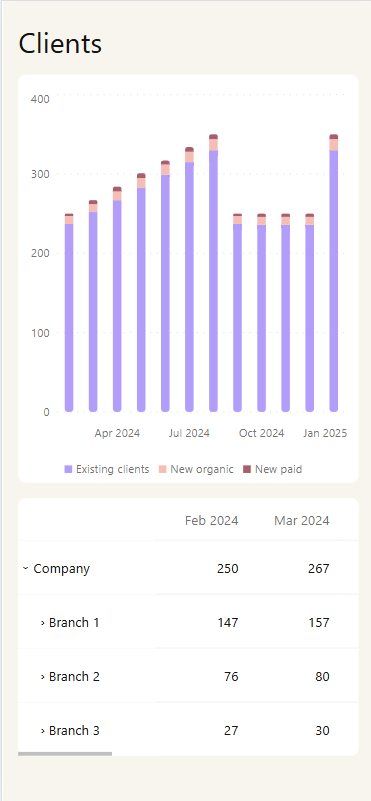

# Financial Dashboard

Financial reporting dashboard built with React, TypeScript, and Node.js.

## Preview

### Desktop



### Mobile

<p align="center">
	
</p>

## Tech stack

- React
- TypeScript
- Vite
- Tailwind CSS
- Recharts
- Zod
- Vitest
- React Testing Library
- Node.js
- Express

## Architecture

See [ARCHITECTURE.md](ARCHITECTURE.md) for the complete runtime flow and dependency boundaries.

## Decision notes

See the [architecture decision notes](./decision-notes/README.md) for how a deliberately simple initial implementation evolved after concrete reliability, validation, maintainability, reuse, lifecycle, accessibility, and testing concerns emerged.

## Installation

Use Node.js `^20.19.0` or `>=22.12.0`, as required by Vite 8.

Install the backend and root tooling dependencies:

```bash
npm install
```

Install the client dependencies:

```bash
cd client
npm install
cd ..
```

## Running locally

Start the REST API from the project root:

```bash
npm run server
```

Start the client in another terminal:

```bash
npm run client
```

Open [http://localhost:5173](http://localhost:5173). The API runs on `http://localhost:4000` and is available to the client through the Vite development proxy.

## Tests

Run the test suite once:

```bash
npm test
```

Run tests in watch mode:

```bash
npm run test:watch
```

Generate a coverage report:

```bash
npm run coverage
```

## Run checks

```bash
npm run typecheck
npm run lint
npm run build
npm run format:check
```

The production client bundle is written to `client/dist`.
