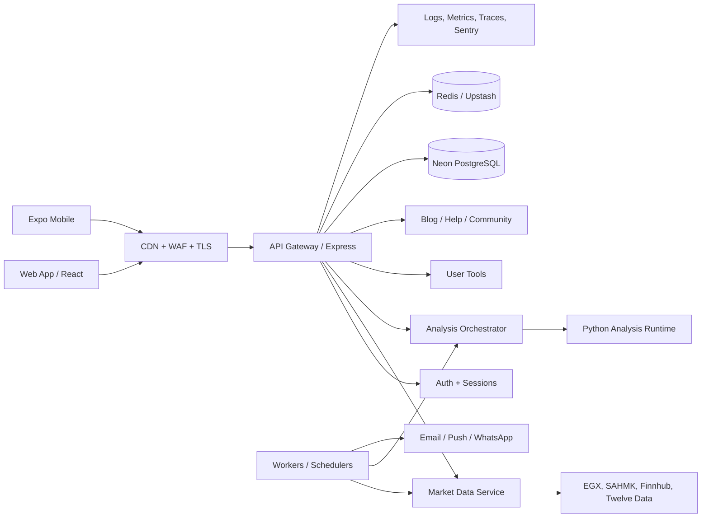

# Borsaty Platform Architecture

## الهدف

تتجه بورصتي إلى منصة مالية عربية متعددة الأسواق، لكن الإطلاق الآمن يتطلب فصل واجهة المستخدم، API، محركات التحليل، والمهام الخلفية دون إعادة كتابة مفاجئة. المعمارية الحالية تبقى نقطة التشغيل، بينما توضح هذه الوثيقة البنية المستهدفة ومسار الانتقال.

## حدود النظام

## قواعد غير قابلة للتفاوض

1. **لا نخلط بيانات السوق مع واجهة العرض.** كل quote أو candle يمر عبر عقد موحد يتضمن `symbol`, `market`, `value`, `timestamp`, `freshness`, و`provenance` داخلياً.
2. **لا توجد أرقام مالية مخترعة.** عند فشل كل المزودين تكون الحالة `unavailable` وتعرض الواجهة شرطة طويلة.
3. **التحليل تعليمي واحتمالي.** لا توجد أوامر تداول حقيقية من محركات Elliott أو Gann أو AI.
4. **كل تغيير كبير قابل للتراجع.** يبدأ بقراءة baseline، ثم قرار معماري، ثم اختبار، ثم commit مستقل.
5. **الأسرار لا تدخل Git.** الإنتاج يحتاج Secrets Manager وrotation، وليس ملفات `.env`.
6. **الخدمات عديمة الحالة.** الجلسات والـrate limits والكاش المشترك لا تعتمد على ذاكرة process واحدة.
7. **المراقبة جزء من الميزة.** كل endpoint مهم يحتاج latency وerror rate وrequest id.

## طبقات الملكية

| الطبقة                   | الملكية     | المسؤولية                       |
| ------------------------ | ----------- | ------------------------------- |
| `apps/web`               | Frontend    | React، التنقل، الوصول، RTL/LTR  |
| `apps/api`               | Backend     | HTTP، المصادقة، العقود، التفويض |
| `services/analysis`      | Python/Node | تحليل لا ينفذ صفقات             |
| `packages/design-system` | مشترك       | tokens ومكونات UI               |
| `packages/types`         | مشترك       | عقود TypeScript العامة          |
| `packages/utils`         | مشترك       | تنسيق، وقت، تحقق                |
| `infrastructure`         | DevOps      | CI، مراقبة، نسخ احتياطي، IaC    |

## مسار الانتقال

- **الحالي:** `client/`, `server/`, `server/python-services/`, `BorsatyMobile/` داخل المستودع الحالي.
- **المرحلة الآمنة:** إضافة `packages/` و`docs/` وCI دون نقل ملفات التطبيق.
- **بعد استقرار CI:** نقل الواجهة إلى `apps/web` عبر branch منفصل مع build مزدوج.
- **بعد قياس الإنتاج:** فصل API والعمال إلى حزم نشر مستقلة.
- **لا يتم حذف أو أرشفة fork خارجي** قبل توثيق استخدامه ووجود بديل اختباري محلي.

## بوابات الجودة قبل الإطلاق

`format -> typecheck -> unit tests -> build -> API smoke -> security checks -> mobile smoke -> Lighthouse -> approval`

## مخاطر معروفة

- قاعدة البيانات المحلية في جلسة التطوير تحتوي على `DATABASE_URL` غير صالح؛ هذا يمنع migration runtime لكنه لا يمنع validation باستخدام رابط PostgreSQL صالح.
- بعض مزودي البيانات الخارجية قد يفرضون rate limits؛ يلزم cache وcircuit breaker قبل اعتمادهم في production.
- Vercel Serverless ليس مناسباً للـWebSocket طويل العمر؛ يفضل تشغيل Socket.io على خدمة Node دائمة أو مزود realtime مستقل.
- trigger deploy
